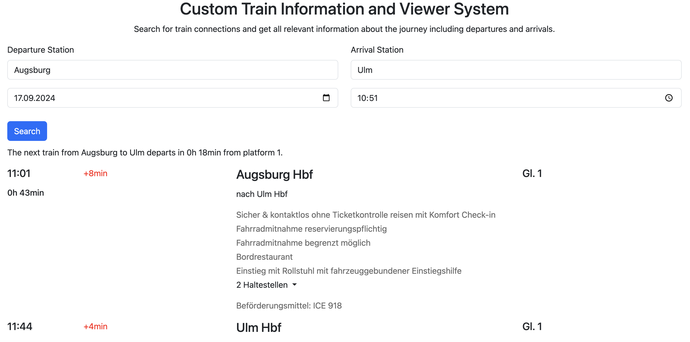
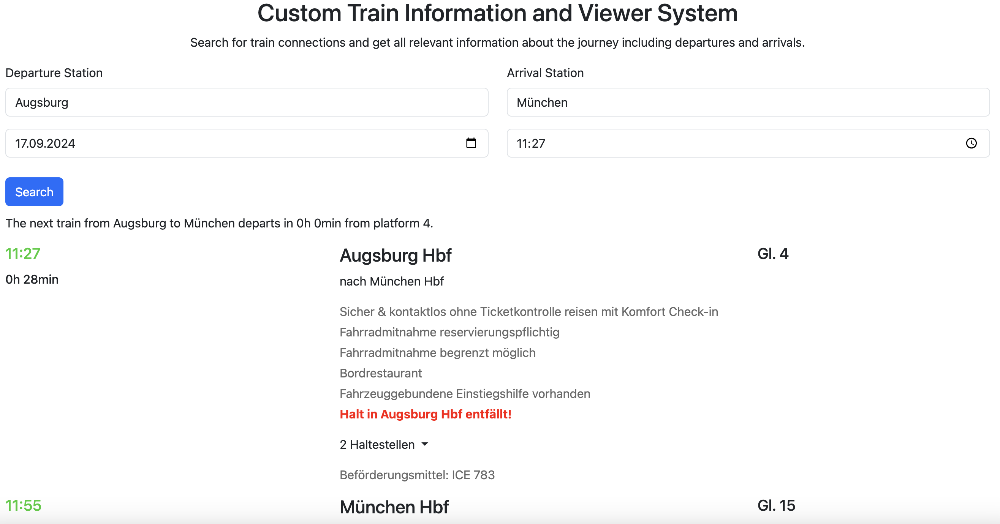

# 🚅 Train Information Application 🚃

This application works on the basic level similar to normal train journey information applications like DB Navigator.
The overall goal and purpose of this project is to collect data and use this data for punctuality prediction with Machine Learning models.

**This is a exercise project made within one week during semester break. 😁**

## Features

The application uses realtime data from the german railway system using the Hafas API. The data is shown in a webbrowser using Bootstrap and Flask.

## Project roadmap

- Collect enough data
- Save data in database
- Read the data and feature engineering
- Experiments with Machine Learning models
- Showcase results

## Additional ideas

- Showcase the software architecture design with UML
- Dockerize the project
- Integrate into cloud environment